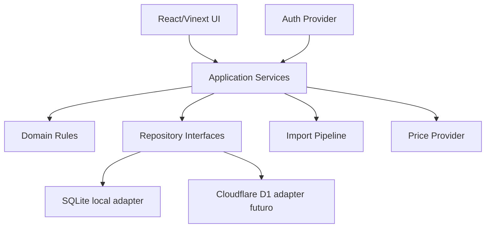
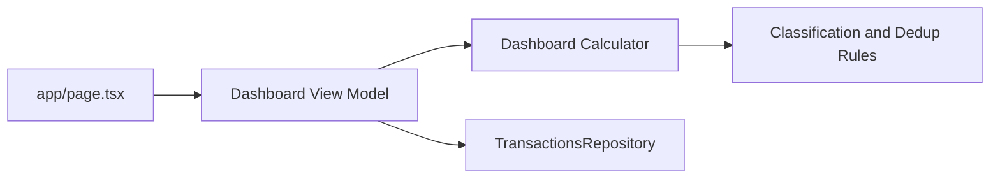
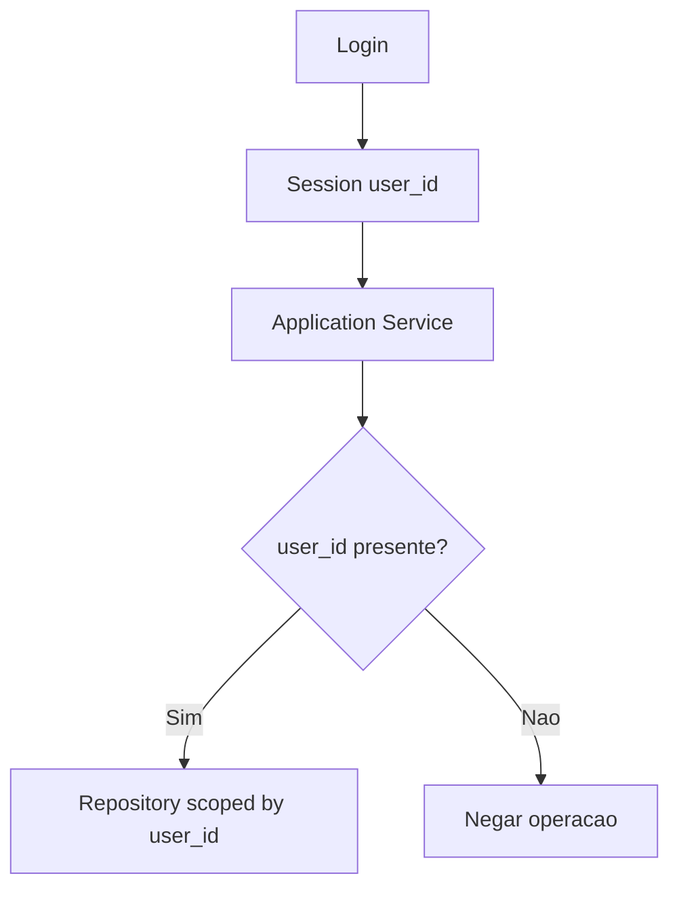

# Arquitetura - Controle Financeiro Pessoal

## Diagnostico da arquitetura atual

O projeto atual usa React 19, Vinext, TypeScript, Tailwind, Drizzle ORM e build para runtime compativel com Cloudflare Worker. A UI principal esta em `app/page.tsx`, os estilos em `app/globals.css`, o layout base em `app/layout.tsx`, e a camada Drizzle em `db/schema.ts` e `db/index.ts`.

Estado observado:
- `app/page.tsx`: concentra apresentacao e consumo de dados locais.
- `lib/finance-data.ts`: dados e helpers iniciais derivados da analise da planilha.
- `lib/price-service.ts`: fallback inicial de precos.
- `db/schema.ts`: modelo Drizzle inicial.
- `scripts/import-custo-mensal.mjs`: staging inicial de importacao.
- `.openai/hosting.json`: nao define D1 atualmente.
- `vite.config.ts` e `worker/index.ts`: indicam build Vinext/Worker.

OpenAI Sites nao deve ser confundido com Cloudflare Pages ou Workers. A publicacao final ainda precisa ser confirmada.

## Arquitetura proposta

Paradigma: arquitetura em camadas com dominio financeiro independente da persistencia.



Invariante arquitetural: `transactions` e o ledger financeiro principal. Dashboard, saldos e relatorios confirmados devem somar valores a partir de `transactions`; tabelas especializadas servem apenas como extensoes por `transaction_id`.

## Componentes e responsabilidades

| Componente | Responsabilidade |
| --- | --- |
| UI | Exibir Dashboard, filtros, previa de importacao e fila de revisao. |
| Application Services | Orquestrar casos de uso: importar, confirmar, calcular Dashboard, buscar precos e aplicar contexto autenticado. |
| Domain Rules | Classificacao em `nature/subtype/origin/status`, anti-duplicidade, saldos derivados, parcelamento, calculos financeiros e validacoes. |
| Repository Interfaces | Contratos de leitura/gravacao sempre escopados ao usuario autenticado. |
| SQLite Adapter | Persistencia local em desenvolvimento. |
| D1 Adapter | Persistencia candidata para producao Cloudflare-compatible. |
| Auth Adapter | Integracao com provedor de login escolhido. |
| Import Pipeline | Leitura, staging, regras, revisao, confirmacao e relatorio. |
| Price Provider | API gratuita, ultimo preco conhecido e fallback manual. |

## Separacao entre apresentacao, regras e persistencia

Regras financeiras nao devem ficar em componentes React. Componentes devem chamar services que retornam view models ja calculados. O `user_id` deve vir de `AuthContext` ou `AuthenticatedUserContext`; a UI nao pode escolher livremente o `user_id` usado pelos repositories.



## Camada de repositorio desacoplada

Interfaces recomendadas:
- `UsersRepository`
- `AccountsRepository`
- `CardsRepository`
- `TransactionsRepository`
- `InvestmentsRepository`
- `ImportsRepository`
- `ClassificationRulesRepository`
- `PricesRepository`

Todos os metodos devem operar com `AuthenticatedUserContext`. O repository deve validar que `card`, `account`, `asset`, `category`, `import_batch` e `transaction` pertencem ao mesmo usuario antes de associar entidades.

Contrato recomendado:

```text
repository.forUser(authenticatedUser).listTransactions(filters)
```

Evitar:

```text
listTransactions(userIdFromUi, filters)
```

## SQLite local

Uso recomendado:
- Banco local para desenvolvimento.
- Migrations Drizzle.
- Seeds de desenvolvimento.
- Testes de integracao com dados pequenos.

Vantagens: simples, rapido, compativel com semantica D1. Limitacao: nao resolve producao multiusuario por si so.

Runner local de migrations:
- O piloto usa `scripts/migrate-local.mjs` para SQLite local.
- O runner abre conexao local, controla `PRAGMA foreign_keys` fora da transacao, executa cada migration pendente com `BEGIN IMMEDIATE`, registra em `__drizzle_migrations` apenas apos sucesso e executa `PRAGMA foreign_key_check` ao final.
- Em falha intermediaria, o runner executa `ROLLBACK`, restaura/verifica `PRAGMA foreign_keys = ON` e nao registra a migration como aplicada.
- Enquanto a Etapa 1 ainda nao estiver commitada, o runner permite reaplicar atomicamente a ultima migration ja registrada se o hash dela mudou; migrations anteriores com hash alterado devem falhar para evitar reescrita perigosa de historico.
- Essa garantia foi validada para SQLite local. Nao declarar compatibilidade com D1 sem teste especifico em ambiente D1/Wrangler.

## Cloudflare D1 como candidato de producao

D1 e candidato forte se a aplicacao for publicada em runtime Cloudflare-compatible, pois usa SQL/SQLite e integra com Workers. Deve ser adotado por adapter, nao diretamente no dominio.

Vantagens:
- Serverless.
- Boa integracao com Workers.
- Semantica SQLite.
- Custo inicial favoravel.

Limitacoes:
- Limite por banco.
- Cada banco e single-threaded.
- Regiao South America nao e location hint atualmente.
- Depende da plataforma final ser compativel.

Recomendacao: manter D1 como candidato preferencial, mas nao definitivo ate confirmar publicacao.

## Estrategia de autenticacao desacoplada

Opcoes:

| Provedor | Vantagens | Limitacoes | Recomendacao |
| --- | --- | --- | --- |
| Auth.js | Controle no app, open source | Mais configuracao e manutencao | Boa opcao se usar stack Node/Next tradicional. |
| Clerk | Rapido, completo, boa UX | Dependencia SaaS e custo futuro | Boa para acelerar MVP com login pronto. |
| Supabase Auth | Auth + Postgres integrados | Puxa arquitetura para Supabase | Boa se Postgres/Supabase for escolhido. |
| Cloudflare Access | Forte para app privado/interno | Menos adequado para SaaS consumer | Bom para acesso privado inicial. |

Regra: nunca armazenar senha em texto puro. Se houver senha propria, usar hashing forte via provedor consolidado. Preferir provedor gerenciado no MVP.

## Seguranca e isolamento por usuario

Invariantes:
- Todo registro financeiro possui `user_id`.
- Queries de leitura e escrita filtram `user_id`.
- O `user_id` vem da sessao autenticada.
- Repositories sao escopados ao usuario autenticado.
- Import batches pertencem a um usuario.
- Regras de classificacao pertencem a um usuario.
- Relacoes entre conta, cartao, ativo, categoria e transacao validam propriedade do mesmo usuario.
- Testes devem cobrir tentativa de acesso cross-user e tentativa de associar entidade de outro usuario.
- Logs nao devem expor valores financeiros sensiveis sem necessidade.
- Administracao futura deve respeitar minimo privilegio.



## Decisoes

| ID | Decisao | Status |
| --- | --- | --- |
| AD-01 | Dashboard sera a primeira entrega. | Aprovada |
| AD-02 | Dominio financeiro sera desacoplado do banco. | Aprovada |
| AD-03 | SQLite sera usado para desenvolvimento local. | Aprovada |
| AD-04 | D1 e candidato de producao, nao decisao final. | Aprovada |
| AD-05 | Login deve existir desde o desenho inicial. | Aprovada |
| AD-06 | Todo registro financeiro exige `user_id`. | Aprovada |
| AD-07 | `transactions` e a fonte financeira principal; especializadas sao extensoes. | Aprovada |
| AD-08 | Saldos sao derivados de saldo inicial + transacoes confirmadas. | Aprovada |
| AD-09 | Rollback e auditavel; nao apaga registros financeiros confirmados. | Aprovada |

## Alternativas descartadas

| Alternativa | Motivo |
| --- | --- |
| Usar planilha como banco | Fragil, sem isolamento, sem idempotencia confiavel. |
| Codificar regras financeiras direto na UI | Dificulta testes, manutencao e troca de persistencia. |
| Somar Dashboard por tabelas especializadas | Risco de dupla contagem; `transactions` deve ser a fonte unica. |
| Permitir `user_id` escolhido pela UI | Risco de vazamento cross-user. |
| Saldo armazenado sem reconciliacao | Pode divergir do ledger financeiro. |
| Escolher D1 definitivamente agora | Plataforma final ainda nao esta totalmente confirmada. |
| Guardar senha em texto puro | Inseguro e proibido. |

## Em aberto

| Tema | Recomendacao |
| --- | --- |
| Provedor de login | Comparar Clerk, Auth.js, Supabase Auth e Cloudflare Access antes de implementar. |
| Banco de producao | Confirmar plataforma de deploy; se Cloudflare-compatible, D1 segue como preferido. |
| Estrategia multiusuario | Comecar com isolamento por `user_id`; avaliar banco unico vs banco por usuario mais adiante. |
