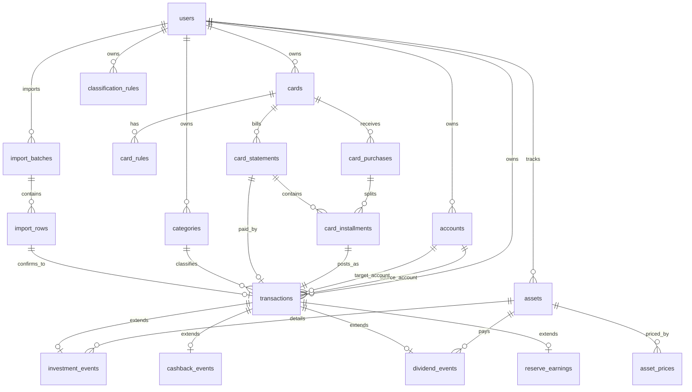

# Modelo de Dados

## Principios

- `transactions` e o livro financeiro principal e a fonte unica dos totais confirmados do Dashboard.
- Todo registro financeiro e toda extensao financeira deve possuir `user_id`.
- O `user_id` vem do contexto autenticado; a UI nao pode escolher livremente o usuario usado pelos repositories.
- Tabelas especializadas detalham eventos, mas nao sao somadas em paralelo com `transactions`.
- Dividendos, cashback real, rendimentos, aportes e reinvestimentos persistidos em tabelas especializadas devem possuir `transaction_id` unico.
- Cashback estimado nao e transacao financeira confirmada; e projecao calculada ou registro nao contabilizavel com estado `ESTIMADO`.
- Saldos devem ser derivados de `opening_balance_cents` + transacoes confirmadas. Saldo armazenado so e permitido como snapshot reconciliado e auditavel.
- Rollback nao apaga registro financeiro; cancela, estorna ou cria reversao auditavel.
- Enquanto nao existir modelo explicito de administrador, delegacao ou compartilhamento, campos de auditoria que apontem usuario (`voided_by`, `confirmed_by`) devem ser nulos ou iguais ao proprio `user_id` do registro.

## Enumeracoes conceituais

### nature

- `DESPESA`
- `RECEITA`
- `TRANSFERENCIA`
- `INVESTIMENTO`

### subtype

- `COMPRA`
- `APORTE`
- `REINVESTIMENTO`
- `PAGAMENTO_FATURA`
- `TRANSFERENCIA_RESERVA`
- `DIVIDENDO`
- `CASHBACK`
- `RENDIMENTO`
- `AJUSTE`

### origin

- `CONTA`
- `CARTAO`
- `CAIXINHA`
- `IMPORTACAO`
- `MANUAL`

### classification_status

- `CONFIRMADO`
- `ESTIMADO`
- `PENDENTE_REVISAO`
- `REJEITADO`

Categorias continuam separadas da classificacao e indicam finalidade analitica, como moradia, veiculo, alimentacao, saude, lazer e investimentos.

Outras enumeracoes:
- `card_status`: `ATIVO`, `HISTORICO`, `ARQUIVADO`
- `import_batch_status`: `STAGED`, `READY_FOR_REVIEW`, `CONFIRMED`, `FAILED`, `ROLLED_BACK`
- `import_row_status`: `PENDENTE`, `ACEITO`, `REJEITADO`, `CONFIRMADO`
- `transaction_status`: `ACTIVE`, `CANCELADO`, `ESTORNADO`
- `cashback_value_type`: `REAL`, `ESTIMADO`

## Entidade-relacionamento

## Entidades

### users

| Campo | Tipo | Obrigatorio | Observacao |
| --- | --- | --- | --- |
| id | text | sim | PK; id interno ou id mapeado do provedor de login. |
| email | text | sim | Unico. |
| name | text | nao | Nome exibido. |
| created_at | text | sim | ISO datetime. |
| updated_at | text | sim | ISO datetime. |

Indice: `unique(email)`.

### accounts

| Campo | Tipo | Obrigatorio | Observacao |
| --- | --- | --- | --- |
| id | text | sim | PK. |
| user_id | text | sim | FK users.id. |
| name | text | sim | Ex.: Conta corrente, Caixinha BTG. |
| account_type | text | sim | `CONTA`, `CAIXINHA`, `RESERVA`, `INVESTIMENTO`. |
| currency | text | sim | ISO currency; default `BRL`. |
| opening_balance_cents | integer | sim | Saldo inicial reconciliado. |
| balance_date | text | sim | Data do saldo inicial. |
| active | boolean | sim | Default true. |

Indices e restricoes:
- `unique(user_id, name)`.
- `opening_balance_cents` pode ser negativo somente se a conta permitir.
- Saldo final derivado: `opening_balance_cents + entradas_confirmadas - saidas_confirmadas`.

### cards

| Campo | Tipo | Obrigatorio | Observacao |
| --- | --- | --- | --- |
| id | text | sim | PK. |
| user_id | text | sim | FK users.id. |
| name | text | sim | BTG, Mercado Pago, Itau historico. |
| issuer | text | nao | Banco/emissor. |
| status | card_status | sim | BTG e Mercado Pago iniciam `ATIVO`; antigos ficam `HISTORICO`. |
| closing_day | integer | sim | Dia de fechamento da fatura, 1 a 31. |
| due_day | integer | sim | Dia de vencimento da fatura, 1 a 31. |

Indice: `unique(user_id, name)`.

### card_rules

| Campo | Tipo | Obrigatorio | Observacao |
| --- | --- | --- | --- |
| id | text | sim | PK. |
| user_id | text | sim | FK users.id. |
| card_id | text | sim | FK cards.id do mesmo usuario. |
| cashback_rate_bps | integer | sim | BTG 100 bps, Mercado Pago 50 bps inicialmente. |
| valid_from | text | sim | Data inicio. |
| valid_to | text | nao | Data fim. |

Restricoes:
- Nao permitir periodos sobrepostos para o mesmo `user_id + card_id`.
- `card_id` deve pertencer ao mesmo `user_id`.

### categories

| Campo | Tipo | Obrigatorio | Observacao |
| --- | --- | --- | --- |
| id | text | sim | PK. |
| user_id | text | sim | FK users.id. |
| name | text | sim | Moradia, veiculo, alimentacao etc. |
| parent_id | text | nao | FK categories.id do mesmo usuario. |
| counts_as_living_cost | boolean | sim | Define se entra no custo de vida. |
| active | boolean | sim | Default true. |

Indice: `unique(user_id, name)`.

### transactions

| Campo | Tipo | Obrigatorio | Observacao |
| --- | --- | --- | --- |
| id | text | sim | PK. |
| user_id | text | sim | FK users.id. |
| nature | nature | sim | DESPESA, RECEITA, TRANSFERENCIA, INVESTIMENTO. |
| subtype | subtype | sim | COMPRA, APORTE, DIVIDENDO etc. |
| origin | origin | sim | CONTA, CARTAO, CAIXINHA, IMPORTACAO, MANUAL. |
| classification_status | classification_status | sim | CONFIRMADO, ESTIMADO, PENDENTE_REVISAO, REJEITADO. |
| transaction_status | transaction_status | sim | ACTIVE, CANCELADO, ESTORNADO. |
| category_id | text | nao | FK categories.id do mesmo usuario. |
| source_account_id | text | nao | Conta de origem; FK accounts.id do mesmo usuario. |
| target_account_id | text | nao | Conta destino; FK accounts.id do mesmo usuario. |
| card_id | text | nao | FK cards.id do mesmo usuario. |
| asset_id | text | nao | FK assets.id do mesmo usuario, quando aplicavel. |
| date | text | sim | Data do evento financeiro. |
| competence_month | text | sim | `YYYY-MM` usado para Dashboard/fatura. |
| description | text | sim | Descricao normalizada. |
| amount_cents | integer | sim | Valor absoluto em centavos. |
| currency | text | sim | ISO currency; default `BRL`. |
| direction | text | sim | `INFLOW`, `OUTFLOW`, `TRANSFER_OUT`, `TRANSFER_IN`, `NEUTRAL`. |
| source_hash | text | nao | Hash da origem confirmada. |
| logical_fingerprint | text | nao | Duplicidade entre versoes da planilha. |
| voided_at | text | nao | Quando cancelado/estornado. |
| voided_by | text | nao | Usuario responsavel. |
| reversal_transaction_id | text | nao | FK transactions.id de reversao. |
| notes | text | nao | Auditoria/observacao. |

Indices:
- `(user_id, date)`.
- `(user_id, competence_month)`.
- `(user_id, nature, subtype, competence_month)`.
- `unique(user_id, source_hash)` quando `source_hash` existir.
- `(user_id, logical_fingerprint)`.

Restricoes:
- `amount_cents >= 0`.
- Toda FK financeira deve pertencer ao mesmo `user_id`.
- `voided_at` e `voided_by` devem ser ambos nulos ou ambos preenchidos.
- Quando preenchido, `voided_by` deve ser igual a `user_id`.
- `classification_status = ESTIMADO` nao pode afetar saldo/patrimonio confirmado.
- `PAGAMENTO_FATURA` deve ter natureza `TRANSFERENCIA`.
- Transferencia deve ter `source_account_id` e `target_account_id` quando ambas forem conhecidas.

Triggers manuais:
- `transactions_reversal_no_two_cycle_insert`.
- `transactions_reversal_no_two_cycle_update`.
- Esses triggers bloqueiam ciclo direto de reversao entre dois registros.
- Eles sao SQL manual na migration e nao aparecem integralmente no snapshot do Drizzle; migrations futuras que reconstruam `transactions` devem recria-los explicitamente.
- Ciclos maiores devem ser bloqueados na camada de dominio/repository em etapa futura.

## Efeito financeiro por natureza

| Natureza | Efeito |
| --- | --- |
| DESPESA | Debita conta ou cria obrigacao no cartao; reduz patrimonio quando confirmada. |
| RECEITA | Credita conta; aumenta patrimonio quando confirmada. |
| TRANSFERENCIA | Debita origem e credita destino; nao altera patrimonio consolidado. |
| INVESTIMENTO | Move caixa para ativo ou reinveste; fora de custo de vida, altera composicao patrimonial. |

## Cartoes e parcelamento

### card_purchases

| Campo | Tipo | Obrigatorio | Observacao |
| --- | --- | --- | --- |
| id | text | sim | PK. |
| user_id | text | sim | FK users.id. |
| card_id | text | sim | FK cards.id do mesmo usuario. |
| purchase_date | text | sim | Data da compra. |
| description | text | sim | Descricao. |
| total_amount_cents | integer | sim | Valor total. |
| total_installments | integer | sim | 1 para compra a vista. |
| currency | text | sim | Default BRL. |
| parent_purchase_id | text | nao | Para ajustes/correcoes. |

### card_installments

| Campo | Tipo | Obrigatorio | Observacao |
| --- | --- | --- | --- |
| id | text | sim | PK. |
| user_id | text | sim | FK users.id. |
| card_purchase_id | text | sim | FK card_purchases.id. |
| card_statement_id | text | nao | FK card_statements.id. |
| transaction_id | text | sim | FK transactions.id unico. |
| installment_number | integer | sim | Parcela atual. |
| total_installments | integer | sim | Total de parcelas. |
| statement_month | text | sim | `YYYY-MM`; competencia da parcela. |
| amount_cents | integer | sim | Valor da parcela. |

Restricao: `unique(user_id, card_purchase_id, installment_number)`.

Regra de fechamento:
- Compra em data <= `closing_day` entra na fatura do ciclo vigente.
- Compra em data > `closing_day` entra na proxima fatura.
- Ajustes para meses com menos dias devem usar o ultimo dia valido do mes.

### card_statements

| Campo | Tipo | Obrigatorio | Observacao |
| --- | --- | --- | --- |
| id | text | sim | PK. |
| user_id | text | sim | FK users.id. |
| card_id | text | sim | FK cards.id. |
| statement_month | text | sim | `YYYY-MM`. |
| closing_date | text | sim | Data fechamento. |
| due_date | text | sim | Data vencimento. |
| payment_transaction_id | text | nao | FK transactions.id de `PAGAMENTO_FATURA`. |

Indice: `unique(user_id, card_id, statement_month)`.

## Investimentos e ativos

### assets

| Campo | Tipo | Obrigatorio | Observacao |
| --- | --- | --- | --- |
| id | text | sim | PK. |
| user_id | text | sim | FK users.id. |
| ticker | text | nao | Pode ser nulo para renda fixa sem ticker. |
| name | text | sim | Nome do ativo/produto. |
| asset_class | text | sim | FII, acao, renda fixa, exterior, caixa etc. |
| exchange | text | nao | B3, NASDAQ, NYSE etc. |
| market | text | nao | Pais/mercado para evitar conflito de ticker. |
| currency | text | sim | Moeda do ativo. |

Indice recomendado: `unique(user_id, ticker, exchange, market)` quando `ticker` existir.

### investment_events

| Campo | Tipo | Obrigatorio | Observacao |
| --- | --- | --- | --- |
| id | text | sim | PK. |
| user_id | text | sim | FK users.id. |
| transaction_id | text | sim | FK transactions.id unico. |
| asset_id | text | sim | FK assets.id. |
| quantity_decimal | text | nao | Decimal em string, precisao minima recomendada 18,8. |
| unit_price_decimal | text | nao | Decimal em string, precisao minima recomendada 18,8. |
| exchange_rate_decimal | text | nao | Cambio usado quando moeda diferente de BRL. |
| gross_amount_cents | integer | sim | Valor bruto na moeda da transacao. |

Precisao:
- Quantidade: suportar fracionarios com pelo menos 8 casas decimais.
- Preco unitario: suportar pelo menos 8 casas decimais.
- Moeda: `currency` obrigatoria no ativo e na transacao.

## Eventos financeiros especializados

### dividend_events

| Campo | Tipo | Obrigatorio | Observacao |
| --- | --- | --- | --- |
| id | text | sim | PK. |
| user_id | text | sim | FK users.id. |
| transaction_id | text | sim | FK transactions.id unico. |
| asset_id | text | sim | FK assets.id. |
| declared_date | text | nao | Data declarada. |
| payment_date | text | sim | Data pagamento. |

### cashback_events

| Campo | Tipo | Obrigatorio | Observacao |
| --- | --- | --- | --- |
| id | text | sim | PK. |
| user_id | text | sim | FK users.id. |
| transaction_id | text | nao | FK transactions.id unico somente para cashback REAL confirmado. |
| card_id | text | sim | FK cards.id. |
| month | text | sim | `YYYY-MM`. |
| amount_cents | integer | sim | Real ou estimado. |
| value_type | cashback_value_type | sim | REAL ou ESTIMADO. |
| rule_id | text | nao | FK card_rules.id. |
| contabilizable | boolean | sim | False para estimativa. |

Restricoes:
- `contabilizable` deve ser booleano persistido como `0` ou `1`.
- `value_type = ESTIMADO` exige `transaction_id = NULL` e `contabilizable = false`.
- `value_type = REAL` exige `transaction_id` preenchido, do mesmo usuario, e `contabilizable = true`.
- O valor financeiro confirmado continua vindo de `transactions`; `cashback_events` detalha o evento.

### reserve_earnings

| Campo | Tipo | Obrigatorio | Observacao |
| --- | --- | --- | --- |
| id | text | sim | PK. |
| user_id | text | sim | FK users.id. |
| transaction_id | text | sim | FK transactions.id unico. |
| account_id | text | sim | FK accounts.id da caixinha/reserva. |
| month | text | sim | `YYYY-MM`. |

## Precos dos ativos

### asset_prices

| Campo | Tipo | Obrigatorio | Observacao |
| --- | --- | --- | --- |
| id | text | sim | PK. |
| user_id | text | sim | Obrigatorio no piloto local; cotacoes ficam isoladas por usuario. |
| asset_id | text | sim | FK assets.id do mesmo usuario. |
| price_decimal | text | sim | Decimal em string. |
| currency | text | sim | Moeda da cotacao. |
| quoted_at | text | sim | Momento da cotacao no provedor. |
| provider | text | sim | API/manual/importacao. |
| fetched_at | text | sim | Momento em que o sistema obteve o preco. |
| is_stale | boolean | sim | Defasagem calculada. |
| source_hash | text | nao | Hash opcional da origem. |

Regra objetiva de defasagem:
- Ativos negociados em bolsa: `is_stale = true` quando `fetched_at` tiver mais de 24 horas em dia util ou quando houver falha na ultima atualizacao.
- Renda fixa/manual: `is_stale = true` quando passar de 30 dias, salvo regra configurada.

Decisao do piloto:
- `asset_prices.user_id` permanece obrigatorio para manter isolamento simples e consistente com o restante do modelo.
- Isso pode gerar cotacoes duplicadas para usuarios diferentes acompanhando o mesmo ativo.
- Precos globais compartilhados, cache unico por ativo/provedor e reducao de duplicidade ficam fora da Etapa 1 e devem ser reavaliados junto com a API de cotacoes.

## Importacao

### import_batches

| Campo | Tipo | Obrigatorio | Observacao |
| --- | --- | --- | --- |
| id | text | sim | PK. |
| user_id | text | sim | FK users.id. |
| source_file_name | text | sim | Nome original. |
| source_file_size | integer | sim | Bytes. |
| file_hash | text | sim | Hash do arquivo exato. |
| parser_version | text | sim | Versao do parser. |
| status | import_batch_status | sim | Estado do lote. |
| started_at | text | sim | Inicio. |
| completed_at | text | nao | Fim do processamento. |
| confirmed_at | text | nao | Confirmacao. |
| confirmed_by | text | nao | FK users.id. |
| error_summary | text | nao | Resumo de erro. |
| rows_total | integer | sim | Contador. |
| rows_accepted | integer | sim | Contador. |
| rows_rejected | integer | sim | Contador. |
| rows_pending | integer | sim | Contador. |

Indice:
- `(user_id, file_hash)`.
- Deve existir indice unico parcial para impedir mais de um lote ativo por `user_id + file_hash`.
- Estados ativos: `STAGED`, `READY_FOR_REVIEW`, `CONFIRMED`.
- Estados encerrados/reprocessaveis: `FAILED`, `ROLLED_BACK`.
- Nao usar `unique(user_id, file_hash)` irrestrito, pois isso bloquearia nova tentativa apos `FAILED` ou `ROLLED_BACK`.
- `status = CONFIRMED` exige `confirmed_at` preenchido e `confirmed_by = user_id`.
- `status <> CONFIRMED` exige `confirmed_at` e `confirmed_by` nulos, salvo futura regra explicita de auditoria diferente.

### import_rows

| Campo | Tipo | Obrigatorio | Observacao |
| --- | --- | --- | --- |
| id | text | sim | PK. |
| user_id | text | sim | FK users.id. |
| batch_id | text | sim | FK import_batches.id. |
| sheet_name | text | sim | Aba. |
| cell_ref | text | nao | Celula/range. |
| raw_label | text | nao | Texto original. |
| raw_value | text | nao | Valor original. |
| raw_row_hash | text | sim | Linha dentro do arquivo. |
| logical_fingerprint | text | sim | Lancamento provavel entre versoes. |
| suggested_nature | nature | nao | Sugestao. |
| suggested_subtype | subtype | nao | Sugestao. |
| suggested_origin | origin | nao | Sugestao. |
| classification_status | classification_status | sim | Estado. |
| normalized_amount_cents | integer | nao | Valor normalizado. |
| status | import_row_status | sim | Revisao. |
| issue | text | nao | Erro/ambiguidade. |
| transaction_id | text | nao | Transacao confirmada. |

Indices:
- `unique(user_id, batch_id, raw_row_hash)`.
- `(user_id, logical_fingerprint)`.

### classification_rules

| Campo | Tipo | Obrigatorio | Observacao |
| --- | --- | --- | --- |
| id | text | sim | PK. |
| user_id | text | sim | FK users.id. |
| pattern | text | sim | Texto/padrao. |
| nature | nature | sim | Natureza sugerida. |
| subtype | subtype | sim | Subtipo sugerido. |
| origin | origin | sim | Origem sugerida. |
| category_id | text | nao | Categoria sugerida. |
| confidence | integer | sim | 0 a 100. |
| active | boolean | sim | Default true. |

## Isolamento multiusuario

- Repositories devem ser escopados por `AuthenticatedUserContext`.
- A UI nunca envia `user_id` arbitrario para escolher escopo.
- Toda relacao entre `transaction`, `card`, `account`, `asset` e `category` deve validar propriedade do mesmo usuario.
- Testes devem cobrir acesso cross-user e associacao de entidade de outro usuario.

## Prevencao de duplicidade

- `file_hash`: identifica o arquivo exato.
- `raw_row_hash`: identifica a linha dentro daquele arquivo.
- `logical_fingerprint`: identifica provavel lancamento financeiro entre versoes.
- `logical_fingerprint` nao inclui `file_hash`.
- Campos recomendados no fingerprint: `user_id`, `nature`, `subtype`, `competence_month`/data, valor, descricao normalizada, conta/cartao/ativo e parcela quando houver.
- Colisao ou baixa confianca vai para revisao; nunca excluir silenciosamente.

## Matriz de rastreabilidade

| Requisito | Regra | Entidade | Documento | Criterio |
| --- | --- | --- | --- | --- |
| RF-02 | Todo financeiro tem usuario | Todas financeiras | PRD.md | CA-02 |
| RF-05 | Classificacao em eixos | `transactions`, `import_rows` | PRD.md | CA-04 |
| RF-08 | Parcelamento | `card_purchases`, `card_installments`, `card_statements` | PRD.md | CA-06, CA-07 |
| RF-10 | Cashback real/estimado | `cashback_events`, `card_rules`, `transactions` | DASHBOARD_RULES.md | CA-09, CA-10 |
| RF-19 | Idempotencia entre versoes | `import_batches`, `import_rows`, `transactions` | IMPORT_STRATEGY.md | CA-15, CA-16 |
| RF-22 | Livro financeiro principal | `transactions` | DASHBOARD_RULES.md | CA-26 |
| RF-23 | Extensoes sem dupla soma | Tabelas especializadas com `transaction_id` | DASHBOARD_RULES.md | CA-26 |
| RF-24 | Saldos e transferencias | `accounts`, `transactions` | DASHBOARD_RULES.md | CA-21, CA-22 |
| RF-25 | Rollback auditavel | `transactions`, `import_batches` | IMPORT_STRATEGY.md | CA-28 |
