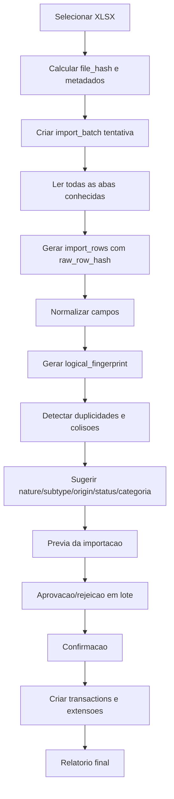

# Estrategia de Importacao da Planilha

## Principios

- A planilha e fonte historica e de requisitos, nao banco operacional.
- A planilha original nao deve ser alterada.
- Toda importacao pertence ao `user_id` do contexto autenticado.
- A importacao cria staging, revisao e confirmacao; somente a confirmacao cria `transactions`.
- `transactions` e a fonte unica dos valores financeiros confirmados.
- A importacao deve ser idempotente dentro do mesmo arquivo e entre versoes diferentes da planilha.
- Ambiguidade ou baixa confianca vai para revisao; nada deve ser excluido silenciosamente.

## Abas lidas

| Aba | Uso |
| --- | --- |
| 2020 | Historico anual de custos/movimentacoes. |
| 2021 | Historico anual de custos/movimentacoes. |
| 2022 | Historico anual de custos/movimentacoes. |
| 2023 | Historico anual de custos/movimentacoes. |
| 2024 | Historico anual de custos/movimentacoes. |
| 2025 | Historico anual de custos/movimentacoes. |
| 2026 | Historico parcial anual de custos/movimentacoes. |
| Investimentos | Aportes, reinvestimentos, posicoes, medias e itens patrimoniais. |
| Cartao | Compras, parcelas, fatura, transferido, caixinha, rendimento e cashback. |
| FIIS - Dividendos | Ativos, quantidades, preco medio, dividendos e yields. |
| Consolidado | Fonte de metas e visao agregada para Dashboard. |
| FisWebDriver | Fonte tecnica historica de precos; nao vira tela. |

## Pipeline

## Controle de lote

`import_batches` deve registrar:
- `id`;
- `user_id`;
- `source_file_name`;
- `source_file_size`;
- `file_hash`;
- `parser_version`;
- `status`;
- `started_at`;
- `completed_at`;
- `confirmed_at`;
- `confirmed_by`;
- `error_summary`;
- contadores: lidas, aceitas, rejeitadas, pendentes, duplicadas, erros.

Nao usar `unique(user_id, file_hash)` irrestrito, pois isso bloquearia nova tentativa apos `FAILED` ou `ROLLED_BACK`. O sistema deve permitir historico de tentativas encerradas, mas impedir mais de um lote ativo do mesmo arquivo por usuario.

Regra do piloto:
- Lote ativo: `STAGED`, `READY_FOR_REVIEW`, `CONFIRMED`.
- Lote encerrado/reprocessavel: `FAILED`, `ROLLED_BACK`.
- Deve existir no maximo um lote ativo por `user_id + file_hash`.
- A mudanca legitima de status do mesmo lote nao e duplicidade; a criacao ou transicao de outro lote para estado ativo com o mesmo hash deve ser rejeitada.
- A confirmacao de lote deve ocorrer em transacao atomica no service futuro.

## Hashes e idempotencia

Separacao obrigatoria:
- `file_hash`: identifica o arquivo exato.
- `raw_row_hash`: identifica uma linha/celula dentro daquele arquivo.
- `logical_fingerprint`: identifica provavel lancamento financeiro entre versoes diferentes.

`logical_fingerprint` nao deve incluir `file_hash`.

Campos recomendados no `logical_fingerprint`:
- `user_id`;
- `nature`;
- `subtype`;
- data ou competencia;
- valor;
- descricao normalizada;
- conta/cartao/ativo;
- parcela, quando houver.

Regras:
- Mesmo `user_id + batch_id + raw_row_hash` nao duplica linha do mesmo lote.
- Mesmo `logical_fingerprint` em versao diferente da planilha sinaliza possivel duplicidade.
- Colisao ou baixa confianca vai para revisao em lote.
- Mais de um lote ativo do mesmo arquivo para o mesmo usuario deve ser bloqueado.
- `FAILED` e `ROLLED_BACK` permitem nova tentativa auditavel.

## Mapeamento por aba

### Abas 2020 a 2026

Transformacao:
- Cada celula mensal com valor vira `import_row`.
- Linhas de total sao usadas para conciliacao, nao como transacao.
- Rotulo, ano, mes e celula entram no raw.
- Classificacao sugerida usa eixos separados.

Exemplos:
- Agua/luz/telefone: `nature = DESPESA`, `subtype = COMPRA` ou `AJUSTE` conforme contexto, `origin = IMPORTACAO`, categoria moradia.
- Cartao: pode ser compra, parcela ou pagamento de fatura; se ambiguo, `PENDENTE_REVISAO`.
- FIIS/acoes/renda fixa: `nature = INVESTIMENTO`, `subtype = APORTE` ou `REINVESTIMENTO`.
- Reserva/caixinha: `nature = TRANSFERENCIA`, `subtype = TRANSFERENCIA_RESERVA`.

### Investimentos

Transformacao:
- Ativos viram `assets`.
- Movimentacoes financeiras confirmadas viram `transactions` com `nature = INVESTIMENTO`.
- Detalhes de quantidade, preco, cambio e ativo viram `investment_events` com `transaction_id`.
- Renda fixa sem ticker deve usar nome/produto, classe e moeda.
- Formulas quebradas geram issue.

### Cartao

Transformacao:
- Compras viram `card_purchases`.
- Parcelas viram `card_installments` e cada parcela confirmada possui `transaction`.
- Data da compra, fechamento, vencimento e `statement_month` devem ser preservados.
- Pagamento de fatura vira `transaction` com `nature = TRANSFERENCIA`, `subtype = PAGAMENTO_FATURA`.
- Transferencia para caixinha vira `TRANSFERENCIA_RESERVA`.
- Cashback real vira `transaction` de receita + `cashback_events`.
- Cashback estimado vira projecao ou evento nao contabilizavel.
- Rendimento de caixinha vira `transaction` de receita + `reserve_earnings`.

### FIIS - Dividendos

Transformacao:
- Ativos viram `assets`.
- Dividendos mensais confirmados viram `transactions` com `nature = RECEITA`, `subtype = DIVIDENDO`.
- Detalhe do dividendo vira `dividend_events` com `transaction_id` unico.
- Precos atuais viram `asset_prices`.
- Erros `#DIV/0!` em linhas vazias nao viram transacao.

### Consolidado

Transformacao:
- Metas e composicoes viram requisitos/indicadores.
- Nao cria transacoes por si so, exceto quando referencia dados rastreaveis em abas fonte.

### FisWebDriver

Transformacao:
- Precos podem virar `asset_prices` com provider `IMPORTACAO`.
- Nao vira pagina.
- API gratuita futura deve atualizar `asset_prices`; falha mantem ultimo preco com `is_stale`.

## Sugestao de regras

Cada regra sugerida deve produzir:
- `nature`;
- `subtype`;
- `origin`;
- `classification_status`;
- categoria complementar;
- confianca.

Regras inseguras nao confirmam automaticamente. Aprovacao e rejeicao acontecem em lote.

## Previa

A previa deve mostrar:
- total de linhas lidas;
- linhas aceitas;
- linhas pendentes;
- linhas rejeitadas;
- duplicidades provaveis;
- colisoes de fingerprint;
- impacto estimado por `nature` e `subtype`;
- diferenca entre totais da planilha e staging;
- erros de formula.

## Confirmacao

Somente apos confirmacao:
- criar `transactions` confirmadas;
- criar extensoes especializadas com `transaction_id` unico;
- criar/atualizar assets, cards, accounts e categories do mesmo usuario;
- marcar lote e linhas como confirmados;
- gerar relatorio final.

Integridade da confirmacao:
- `status = CONFIRMED` exige `confirmed_at` e `confirmed_by`.
- Enquanto nao houver administrador/delegacao, `confirmed_by` deve ser igual ao `user_id` do lote.
- Lote nao confirmado nao deve possuir campos de confirmacao preenchidos.

## Rollback auditavel

Rollback nao deve apagar definitivamente registros financeiros.

Estrategias permitidas:
- marcar `transactions.transaction_status = CANCELADO`;
- preencher `voided_at` e `voided_by`;
- criar `reversal_transaction_id` quando necessario;
- marcar lote como `ROLLED_BACK`.

Registros deixam de afetar o Dashboard, mas permanecem rastreaveis.

## Relatorio final

Campos obrigatorios:
- arquivo;
- `file_hash`;
- `parser_version`;
- usuario;
- inicio/fim/confirmacao;
- confirmado por;
- linhas lidas, aceitas, rejeitadas, pendentes, duplicadas e com erro;
- totais por `nature` e `subtype`;
- formulas quebradas;
- ambiguidades;
- rollback/reversao, se houver.

## Tratamento de problemas

| Problema | Tratamento |
| --- | --- |
| Formula `#REF!` | Registrar issue; nao importar valor como definitivo. |
| Formula `#DIV/0!` | Se linha vazia, ignorar; senao enviar para revisao. |
| Valor vazio | Ignorar se contexto vazio; pendente se campo obrigatorio. |
| Data serial Excel | Converter para ISO date e exibir em pt-BR. |
| Texto monetario `R$ 9,69` | Normalizar para centavos ou decimal de preco. |
| Linha ambigua | `classification_status = PENDENTE_REVISAO`. |
| Total de linha/coluna | Usar para conciliacao, nao como transacao. |
| Duplicidade provavel | Enviar para revisao; nao excluir silenciosamente. |

## Criterios de aceite da importacao

| ID | Criterio |
| --- | --- |
| IMP-CA-01 | Dado arquivo ja confirmado, quando importar novamente o mesmo arquivo, entao nao deve haver confirmacao duplicada ativa. |
| IMP-CA-02 | Dado arquivo com importacao `FAILED`, quando importar novamente, entao o sistema deve permitir nova tentativa com novo lote. |
| IMP-CA-03 | Dado lancamento repetido em versao diferente da planilha, quando gerar staging, entao o `logical_fingerprint` deve sinalizar duplicidade provavel. |
| IMP-CA-04 | Dada colisao ou baixa confianca de fingerprint, quando gerar previa, entao a linha deve ir para revisao. |
| IMP-CA-05 | Dada linha ambigua, quando gerar previa, entao ela aparece como pendente. |
| IMP-CA-06 | Dado erro de formula, quando importar, entao o erro aparece no relatorio. |
| IMP-CA-07 | Dada aprovacao em lote, quando confirmar, entao todas as linhas afetadas usam a regra aprovada. |
| IMP-CA-08 | Dado pagamento de fatura, quando confirmar, entao ele cria transferencia/liquidacao e nao despesa duplicada. |
| IMP-CA-09 | Dado rollback, quando executado, entao registros deixam de afetar Dashboard sem serem apagados definitivamente. |
| IMP-CA-10 | Dado lote `STAGED`, `READY_FOR_REVIEW` ou `CONFIRMED`, quando outro lote do mesmo usuario e mesmo hash tentar ficar ativo, entao o sistema deve rejeitar. |
| IMP-CA-11 | Dado lote `ROLLED_BACK`, quando importar novamente o mesmo arquivo, entao o sistema deve permitir nova tentativa auditavel. |

## Matriz de rastreabilidade

| Requisito | Regra | Entidade | Documento | Criterio |
| --- | --- | --- | --- | --- |
| RF-17 | Revisao em lote | `import_rows`, `classification_rules` | PRD.md | IMP-CA-05, IMP-CA-07 |
| RF-18 | Confirmacao/rejeicao | `import_batches`, `import_rows` | DATA_MODEL.md | IMP-CA-07 |
| RF-19 | Idempotencia entre versoes | `import_batches`, `import_rows`, `transactions` | DATA_MODEL.md | IMP-CA-01, IMP-CA-03 |
| RF-20 | Planilha nao e banco | `import_batches`, `import_rows` | PRD.md | IMP-CA-06 |
| RF-21 | Relatorio final | `import_batches` | PRD.md | IMP-CA-06 |
| RF-22 | Transactions como fonte | `transactions` | DASHBOARD_RULES.md | IMP-CA-08 |
| RF-25 | Rollback auditavel | `transactions`, `import_batches` | DATA_MODEL.md | IMP-CA-09 |
